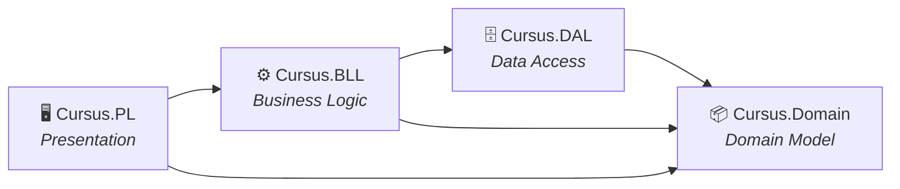

# Contributing to Cursus

Welcome to the Cursus project! This guide will help you get started as a contributor and keep our codebase clean and consistent.

---

## Development Setup

### Prerequisites

Make sure you have the following installed:

- [.NET 10 SDK](https://dotnet.microsoft.com/download/dotnet/10.0)
- [SQL Server](https://www.microsoft.com/en-us/sql-server/sql-server-downloads) (LocalDB is fine for development)
- [Visual Studio 2022](https://visualstudio.microsoft.com/) (recommended) or VS Code with C# extension
- [Git](https://git-scm.com/)

### First-Time Setup

```bash
# Clone the repo
git clone https://github.com/3bdo-Yahya/Cursus.git
cd Cursus/src

# Restore NuGet packages
dotnet restore

# Apply database migrations
dotnet ef database update --project Cursus.DAL --startup-project Cursus.PL

# Run the project
dotnet run --project Cursus.PL
```

> For detailed OS-specific instructions (Windows vs Linux/Docker), see [SETUP.md](SETUP.md).

---

## Implementation Workflow (Gitflow Lite)

We use a customized **Gitflow Lite** workflow adapted for our sprint structure, consisting of three main branch types: `master`, `develop`, and sprint-specific `release/` branches.

### Branch Flow

1. **Feature to Develop:** Developers create `feature/*` or `fix/*` branches dynamically from `develop`. When finished, they open a Pull Request (PR) to merge back into `develop`.
2. **Develop to Sprint:** At the end of the sprint, we create a `release/sprint-X` branch from `develop`. We perform final integration testing and bug fixes exclusively here to keep `develop` unblocked for the next sprint.
3. **Sprint to Master:** Once the sprint release is stable, we merge `release/sprint-X` into `master` (and back into `develop` if any bug fixes were made during the release phase).

```text
master (production-ready demos)
  └── release/sprint-1 (sprint finalization)
        └── develop (active integration branch)
              ├── feature/auth-system
              ├── feature/course-crud
              └── fix/gpa-calculation-bug
```

---

## Best Practices & Pull Requests

To keep our codebase healthy and prevent "broken" code from blocking teammates, follow these best practices:

1. **Protection Rules for `develop`:** 
   We enforce strict branch protection on `develop`. You cannot merge a PR unless it has:
   - At least one **approved peer review**.
   - A passing build (CI check). Our CI pipeline ([`.github/workflows/dotnet-ci.yml`](.github/workflows/dotnet-ci.yml)) automatically builds the code to catch errors.
   - *Never push directly to `master` or `develop`.*
2. **Small PRs:** 
   Encourage the team to keep feature branches small. This makes code reviews faster, reduces cognitive load, and minimizes painful merge conflicts in the Cursus project.
3. **Squash Merges:** 
   When merging `feature/*` branches into `develop`, always use **Squash and Merge**. This keeps the `develop` history clean by combining many small, noisy commits into one descriptive, atomic commit.
4. **Delete Branches:** 
   Delete your `feature/*` branches immediately after they are merged. This keeps the repository tidy and prevents confusion.
5. **Always pull before starting:**
   ```bash
   git checkout develop
   git pull origin develop
   git checkout -b feature/your-feature-name
   ```

### PR Checklist

Before submitting, make sure:

- [ ] The code compiles without errors (`dotnet build` from `src/`)
- [ ] The app runs and the feature works as expected (`dotnet run --project Cursus.PL`)
- [ ] No hardcoded values — use configuration files or constants
- [ ] Views follow the shared layout and use Bootstrap components
- [ ] Controller actions have `[Authorize]` attributes where needed
- [ ] `[ValidateAntiForgeryToken]` is present on all `POST` actions
- [ ] No `bin/`, `obj/`, `.vs/`, or IDE files are included in the commit
- [ ] New files are placed in the correct layer project (see Architecture below)

---

## Project Architecture (N-Tier)

Cursus uses a **4-layer N-tier** architecture. Each layer is a separate .NET project with strictly controlled dependencies:



### Where Does My Code Go?

| What you're building | Put it in | Example |
|---|---|---|
| Domain entity or enum | `Cursus.Domain/Entities/` or `Enums/` | `Course.cs`, `AcademicStanding.cs` |
| EF Core configuration | `Cursus.DAL/Configurations/` | `CourseConfiguration.cs` |
| Database migration | `Cursus.DAL/Migrations/` | Auto-generated by `dotnet ef` |
| Seed data (JSON) | `Cursus.DAL/Database/SeedData/` | `curriculum.json` |
| Business service | `Cursus.BLL/` | `ICourseService.cs`, `CourseService.cs` |
| MVC Controller | `Cursus.PL/Controllers/` | `AdminController.cs` |
| ViewModel (PL-specific) | `Cursus.PL/Models/` | `AdminDashboardViewModel.cs` |
| Razor View | `Cursus.PL/Views/{ControllerName}/` | `Dashboard.cshtml` |
| Shared partial | `Cursus.PL/Views/Shared/` | `_AcademicStandingBadge.cshtml` |
| Page CSS | `Cursus.PL/wwwroot/css/pages/{role}/` | `student-dashboard.css` |
| Page JS | `Cursus.PL/wwwroot/js/pages/{role}/` | `course-map.js` |

### ⚠️ Architecture Rules

1. **`Cursus.Domain` must have zero infrastructure dependencies.** No `using Microsoft.EntityFrameworkCore` or `using Microsoft.AspNetCore` allowed.
2. **`Cursus.DAL` must not reference `Cursus.PL` or `Cursus.BLL`.** Data flows up, never down.
3. **Controllers must not reference `Cursus.DAL` directly** (target state). Use BLL services as the intermediary. During migration, existing direct `DbContext` usage is acceptable but should be refactored.
4. **All MVC files live exclusively in `Cursus.PL`.** Never create controllers, views, or wwwroot assets outside this project.
5. **ViewModels live in `Cursus.PL/Models/`**, not in `Cursus.Domain`. Domain entities and PL ViewModels are separate concerns.

---

## Code Conventions

### C# / Backend

- **Naming:** PascalCase for classes, methods, and properties. camelCase for local variables and parameters.
- **Controllers:** Keep thin — delegate logic to service classes in `Cursus.BLL`.
- **Services:** All business logic lives in `Cursus.BLL/`. One service per feature domain (e.g., `GpaService`, `ImpactAnalysisService`). Register in DI via `Program.cs`.
- **Models:**
  - `Cursus.Domain/Entities/` — EF Core database entities
  - `Cursus.PL/Models/` — View-specific models passed to Razor views
- **Don't put logic in views.** If you need conditional logic, compute it in the controller/service and pass a clean ViewModel.

### Razor Views

- Use the shared `_Layout.cshtml` for all pages (role-based navbar is handled automatically).
- Use **partial views** in `Views/Shared/` for reusable components (badges, progress bars, cards).
- Use `asp-for` and `asp-validation-for` tag helpers for forms.
- Use **Bootstrap 5** classes for layout and components — don't reinvent the wheel.

### JavaScript

- Keep JS minimal — only for interactive components (graph, chat, GPA calculator).
- Place JS files in `wwwroot/js/pages/{role}/` (e.g., `wwwroot/js/pages/student/course-map.js`).
- Use `jQuery` (bundled with MVC) or vanilla JS — no npm packages.
- For AJAX calls, use `$.ajax()` or `fetch()` consistently (pick one, don't mix).

### Database

- **Never modify the database directly.** Always use EF Core migrations:
  ```bash
  # From the src/ directory:
  dotnet ef migrations add MigrationName --project Cursus.DAL --startup-project Cursus.PL
  dotnet ef database update --project Cursus.DAL --startup-project Cursus.PL
  ```
- Name migrations descriptively: `AddCoursePrerequisiteTable`, `UpdateStudentStanding`.

---

## Commit Messages

Write clear, concise commit messages:

```
✅ Good:
  "Add course CRUD operations to AdminController"
  "Fix GPA calculation rounding error"
  "Implement prerequisite graph visualization with Cytoscape.js"

❌ Bad:
  "Update files"
  "Fix stuff"
  "WIP"
```

**Format:** Start with a verb in imperative mood (Add, Fix, Implement, Update, Remove, Refactor).

---

## Feature Ownership

Each team member owns specific modules. If you need to change code in someone else's module, **coordinate with them first** (or tag them as a reviewer on the PR).

---

## Definition of Done

A feature is ready for PR when:

- [ ] Controller actions and service logic are implemented
- [ ] Razor views render correctly with proper layout and styling
- [ ] Forms have both client-side and server-side validation
- [ ] Edge cases handled (empty states, errors, unauthorized access)
- [ ] `dotnet build` compiles without errors or warnings
- [ ] Feature is manually tested and works end-to-end
- [ ] Code follows the conventions in this document
- [ ] Files are in the correct layer project

---

## Communication

| Channel | Purpose |
|---|---|
| **ClickUp** | Sprint tracking, ticket management, SDLC documents |
| **WhatsApp** | Daily async standups, quick questions |
| **GitHub PRs** | Code reviews, technical discussions |
| **Weekly sync** | Sprint planning every 2 weeks |

---

## Need Help?

- **Stuck on a bug?** Post in the team chat with: what you tried, what error you see, and which file/line.
- **Unsure about architecture?** Ask the Team Lead before building — it's cheaper to discuss than to rewrite.
- **Found a bug you can't fix?** Create a GitHub Issue with steps to reproduce.

---

*Let's build something great together. 🚀*
