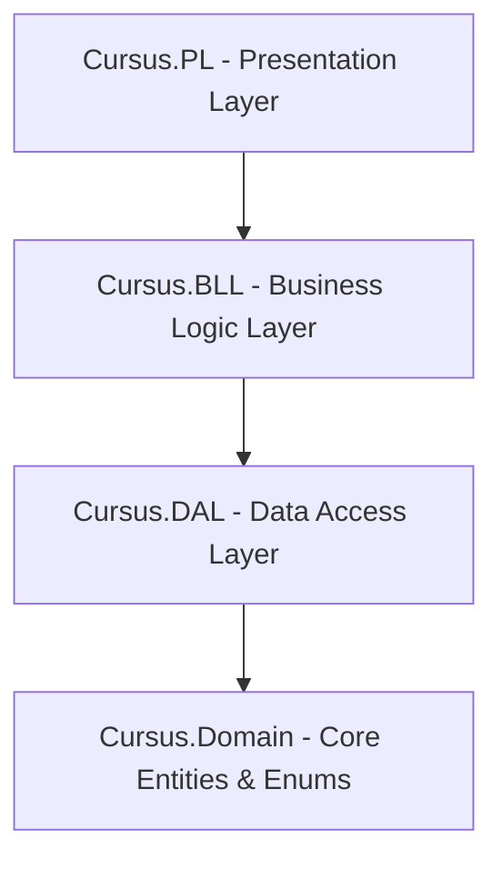

# Cursus Project Map & Codebase Navigation

This file maps out the architecture and structure of the **Cursus** solution to facilitate navigation and future implementations.

---

## 🏗️ 4-Tier Architecture Overview

The codebase is organized into four separate projects inside the `/src` folder:

- **[Cursus.Domain](file:///d:/Cursus/src/Cursus.Domain/)**: Core domain models, entities, and enums. Has zero external dependencies.
- **[Cursus.DAL](file:///d:/Cursus/src/Cursus.DAL/)**: Entity Framework Core database context, table configurations, and database migrations.
- **[Cursus.BLL](file:///d:/Cursus/src/Cursus.BLL/)**: Business logic, services, rules, and validators.
- **[Cursus.PL](file:///d:/Cursus/src/Cursus.PL/)**: ASP.NET Core MVC presentation layer, Razor Views, static assets (JS, CSS), routing, and Identity pages.

---

## 🗂️ Core Project Modules

### 1. 🧬 Domain Layer (`Cursus.Domain`)
Location: `src/Cursus.Domain/`

- **[Entities](file:///d:/Cursus/src/Cursus.Domain/Entities/)**:
  - [AppUser.cs](file:///d:/Cursus/src/Cursus.Domain/Entities/AppUser.cs): Main Identity user model representing administrators and students.
  - [Course.cs](file:///d:/Cursus/src/Cursus.Domain/Entities/Course.cs): Course definition (Credit Hours, Type, Availability).
  - [CoursePrerequisite.cs](file:///d:/Cursus/src/Cursus.Domain/Entities/CoursePrerequisite.cs): Many-to-many relationship mapping courses to their prerequisites.
  - [Department.cs](file:///d:/Cursus/src/Cursus.Domain/Entities/Department.cs): Department details belonging to a University.
  - [University.cs](file:///d:/Cursus/src/Cursus.Domain/Entities/University.cs): University details.
  - [StudentCourse.cs](file:///d:/Cursus/src/Cursus.Domain/Entities/StudentCourse.cs): Student course enrollment, grade, and status.
  - [StandingHistory.cs](file:///d:/Cursus/src/Cursus.Domain/Entities/StandingHistory.cs): Historical log of a student's academic standing.
  - [CreditHourRule.cs](file:///d:/Cursus/src/Cursus.Domain/Entities/CreditHourRule.cs), [GradeScale.cs](file:///d:/Cursus/src/Cursus.Domain/Entities/GradeScale.cs), [GraduationRequirement.cs](file:///d:/Cursus/src/Cursus.Domain/Entities/GraduationRequirement.cs), [GraduationRequirementCourse.cs](file:///d:/Cursus/src/Cursus.Domain/Entities/GraduationRequirementCourse.cs).
- **[Enums](file:///d:/Cursus/src/Cursus.Domain/Enums/)**:
  - [AcademicStanding.cs](file:///d:/Cursus/src/Cursus.Domain/Enums/AcademicStanding.cs): `Good`, `Warning`, `Probation`, `Dismissed`.
  - [SemesterType.cs](file:///d:/Cursus/src/Cursus.Domain/Enums/SemesterType.cs): `Fall`, `Spring`, `Summer`.
  - [StudentCourseStatus.cs](file:///d:/Cursus/src/Cursus.Domain/Enums/StudentCourseStatus.cs): `Planned`, `Enrolled`, `Passed`, `Failed`.
  - [CourseType.cs](file:///d:/Cursus/src/Cursus.Domain/Enums/CourseType.cs): `Core`, `DeptElective`, `FreeElective`, `UniversityReq`.
  - [SemesterAvailability.cs](file:///d:/Cursus/src/Cursus.Domain/Enums/SemesterAvailability.cs): `Fall`, `Spring`, `FallSpring`, `All`.

### 2. 🗄️ Data Access Layer (`Cursus.DAL`)
Location: `src/Cursus.DAL/`

- **[Database/ApplicationDbContext.cs](file:///d:/Cursus/src/Cursus.DAL/Database/ApplicationDbContext.cs)**: Main database context registering all core `DbSet` collections.
- **[Configurations/](file:///d:/Cursus/src/Cursus.DAL/Database/Configurations/)**: Entity Framework mapping rules for constraints and foreign key relationships.
- **[Database/SeedData/](file:///d:/Cursus/src/Cursus.DAL/Database/SeedData/)**: Catalog JSON files for universities (such as South Valley National University, American University in Cairo, Sinai University) containing curriculum courses, graduation requirements, and prerequisites.
- **[Migrations/](file:///d:/Cursus/src/Cursus.DAL/Migrations/)**: Entity Framework schema migration files.

### 3. 🧠 Business Logic Layer (`Cursus.BLL`)
Location: `src/Cursus.BLL/`

- Service interfaces and implementations handling the core application logic.
- Managed via dependency injection.

### 4. 💻 Presentation Layer (`Cursus.PL`)
Location: `src/Cursus.PL/`

- **[Program.cs](file:///d:/Cursus/src/Cursus.PL/Program.cs)**: Application bootstrap, identity configuration, DB initialization, and service registrations.
- **[Controllers/](file:///d:/Cursus/src/Cursus.PL/Controllers/)**:
  - [HomeController.cs](file:///d:/Cursus/src/Cursus.PL/Controllers/HomeController.cs): Public homepage and error handling.
  - [AdminController.cs](file:///d:/Cursus/src/Cursus.PL/Controllers/AdminController.cs): Core admin actions (Universities, Departments, Courses, and Students).
  - [StudentController.cs](file:///d:/Cursus/src/Cursus.PL/Controllers/StudentController.cs): Student operations (Dashboard, Course Map, Planner, Progress, Advisor, GPA Simulator).
- **[Views/](file:///d:/Cursus/src/Cursus.PL/Views/)**:
  - **[Admin/](file:///d:/Cursus/src/Cursus.PL/Views/Admin/)**: Views for course/department creation, edit forms, dashboard indices, and admin profile.
  - **[Student/](file:///d:/Cursus/src/Cursus.PL/Views/Student/)**: Student UI dashboards, planners, advisors, and progress calculators.
  - **[Shared/](file:///d:/Cursus/src/Cursus.PL/Views/Shared/)**: Core layout wrapper (`_Layout.cshtml`), dynamic navbar (`_Navbar.cshtml`), course status badges, standing indicators, and alert partials.
- **[Areas/Identity/](file:///d:/Cursus/src/Cursus.PL/Areas/Identity/)**: Scaffolding for login, registration, and logout pages.
- **[Seeding/StartupSeeder.cs](file:///d:/Cursus/src/Cursus.PL/Seeding/StartupSeeder.cs)**: Handles reading local seed files and populating the database with universities, departments, courses, and rules on application start.
- **[wwwroot/](file:///d:/Cursus/src/Cursus.PL/wwwroot/)**:
  - CSS stylesheets matching dark/light mode themes, page-specific stylings (`admin/students.css`, `admin/courses.css`).
  - Interactive JS components for graphs, selectors, and planners (`student/course-map.js`, `admin/students.js`).
