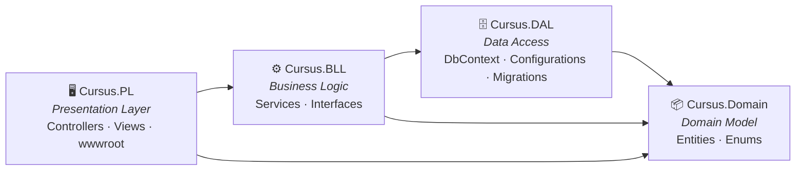

# Cursus

**Tu Asesor Académico Impulsado por IA y Planificador Inteligente de Graduación**

> Proyecto de Graduación de DEPI — Desarrollo Web Full-Stack (.NET)

---

## ¿Qué es Cursus?

Cursus es una plataforma web que ayuda a los estudiantes universitarios a **ver, comprender y planificar** su trayectoria académica. Modela la cadena completa de dependencias de prerrequisitos de un programa de grado y la utiliza para proporcionar análisis de impacto en tiempo real, seguimiento de graduación y orientación académica impulsada por IA.

**La idea central:** Cuando un estudiante reprueba una materia, las consecuencias rara vez son obvias. Esa materia reprobada puede ser un prerrequisito para dos o tres cursos posteriores, colapsando silenciosamente el plan del estudiante. Cursus hace que esas consecuencias sean **instantáneamente visibles** y proporciona una ruta de recuperación clara.

---

## Stack Tecnológico

| Capa           | Tecnología                                  |
|----------------|---------------------------------------------|
| Aplicación     | ASP.NET Core 10 MVC, C#, Razor Views       |
| Estilos        | Bootstrap 5 + sistema de diseño CSS personalizado |
| Visor de Grafos| Cytoscape.js (mapa interactivo de prerrequisitos) |
| Base de Datos  | SQL Server + Entity Framework Core          |
| Autenticación  | ASP.NET Identity (basada en cookies y roles) |
| IA             | OpenAI API (GPT-3.5-turbo)                  |
| CI/CD          | GitHub Actions (`dotnet-ci.yml`)            |

---

## Arquitectura

Cursus utiliza una arquitectura **N-tier de 4 capas**, con cada capa aislada en su propio proyecto de .NET:



| Capa | Proyecto | Responsabilidad |
|-------|---------|----------------|
| **Presentación** | `Cursus.PL` | Controladores ASP.NET MVC, vistas Razor, activos estáticos, UI de Identity, seeding |
| **Lógica de Negocio** | `Cursus.BLL` | Interfaces e implementaciones de servicios, reglas de negocio, validación |
| **Acceso a Datos** | `Cursus.DAL` | EF Core `ApplicationDbContext`, configuraciones de entidades, migraciones, datos semilla |
| **Dominio** | `Cursus.Domain` | Entidades y enums puros de C# — cero dependencias de infraestructura |

### Principio Clave

```
Controller → Service (BLL) → DbContext (DAL) → Domain Entities
```

Los controladores se mantienen ligeros. La lógica de negocio reside en los servicios. Las entidades de dominio no tienen conocimiento de EF Core o HTTP.

---

## Estructura del Proyecto

```
Cursus/
├── src/
│   ├── Cursus.sln                    # Archivo de solución
│   │
│   ├── Cursus.Domain/                # Capa de Dominio (entidades y enums)
│   │   ├── Entities/                 #   AppUser, Course, Department, University, ...
│   │   └── Enums/                    #   AcademicStanding, CourseType, StudentCourseStatus, ...
│   │
│   ├── Cursus.DAL/                   # Capa de Acceso a Datos
│   │   ├── Database/
│   │   │   ├── ApplicationDbContext.cs
│   │   │   └── SeedData/             #   Archivos JSON de semilla por universidad
│   │   ├── Configurations/           #   Configs de Fluent API de EF Core
│   │   └── Migrations/
│   │
│   ├── Cursus.BLL/                   # Capa de Lógica de Negocio
│   │   └── (servicios agregados por funcionalidad en Sprint 2+)
│   │
│   └── Cursus.PL/                    # Capa de Presentación (proyecto de inicio)
│       ├── Controllers/              #   AdminController, StudentController, HomeController, ...
│       ├── Models/                   #   ViewModels (AdminDashboardVM, CourseNodeVM, ...)
│       ├── Views/                    #   Vistas Razor organizadas por controlador
│       │   ├── Shared/               #     _Layout, _Navbar, _AuthLayout, parciales
│       │   ├── Admin/
│       │   ├── Student/
│       │   └── Home/
│       ├── Areas/Identity/           #   Páginas de Identity generadas (Login, Register, ...)
│       ├── Seeding/                  #   StartupSeeder para datos del catálogo
│       ├── wwwroot/                  #   Activos estáticos
│       │   ├── css/pages/            #     Hojas de estilo por página
│       │   ├── js/pages/             #     Scripts por página
│       │   └── lib/                  #     Bootstrap, jQuery
│       ├── Program.cs
│       └── appsettings.json
│
├── .github/workflows/dotnet-ci.yml   # Pipeline de CI
├── CONTRIBUTING.md
├── SETUP.md
├── README.md
└── docs/                             # Documentación interna
```

---

## Primeros Pasos

### Prerrequisitos

- [.NET 10 SDK](https://dotnet.microsoft.com/download/dotnet/10.0)
- [SQL Server](https://www.microsoft.com/en-us/sql-server/sql-server-downloads) (LocalDB, Express, o Docker)
- Un editor de código (Visual Studio 2022, Rider, o VS Code)

### Inicio Rápido

```bash
# Clonar el repositorio
git clone https://github.com/3bdo-Yahya/Cursus.git
cd Cursus/src

# Restaurar dependencias
dotnet restore

# Aplicar migraciones de base de datos
dotnet ef database update --project Cursus.DAL --startup-project Cursus.PL

# Ejecutar la aplicación
dotnet run --project Cursus.PL
```

La aplicación estará disponible en `https://localhost:5001` (o el puerto que se muestre en la terminal).

> **Nota:** Para instrucciones detalladas de configuración específicas del SO (Windows vs Linux/Docker), consulta [SETUP.md](SETUP.md).

> **Seguridad:** Si habilitas la semilla de identidad para pruebas locales, proporciona las credenciales del administrador a través de configuraciones locales seguras, como variables de entorno o user-secrets de .NET. No confíes en credenciales sembradas en entornos compartidos o de producción.

---

## Contribución

Por favor, lee [CONTRIBUTING.md](CONTRIBUTING.md) para conocer nuestro flujo de trabajo de desarrollo, estrategia de ramificación, reglas de arquitectura y convenciones de codificación.

---

## Licencia

Este proyecto está licenciado bajo los términos especificados en [LICENSE.txt](LICENSE.txt).

---

*Proyecto de Graduación de DEPI 2026 · Desarrollo Web Full-Stack (.NET)*
