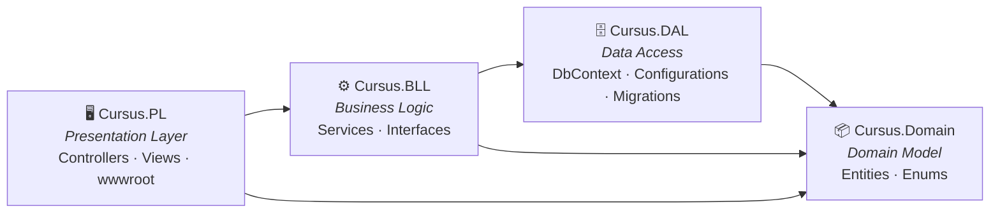

# Cursus

**Your AI-Powered Academic Advisor & Smart Graduation Planner**

> DEPI Graduation Project — Full-Stack Web Development (.NET)

---

## What is Cursus?

Cursus is a web platform that helps university students **see, understand, and plan** their academic journey. It models the full prerequisite dependency chain of a degree program and uses it to provide real-time impact analysis, graduation tracking, and AI-powered academic guidance.

**The core idea:** When a student fails a course, the consequences are rarely obvious. That failed course may be a prerequisite for two or three upcoming courses — silently collapsing the student's plan. Cursus makes those consequences **instantly visible** and provides a clear recovery path.

---

## Tech Stack

| Layer          | Technology                                  |
|---|---|
| Application    | ASP.NET Core 10 MVC, C#, Razor Views        |
| Styling        | Bootstrap 5 + custom CSS design system      |
| Graph Viz      | Cytoscape.js (interactive prerequisite map) |
| Database       | SQL Server + Entity Framework Core          |
| Auth           | ASP.NET Identity (cookie-based, role-based) |
| AI             | Google Gemini API (Gemini 2.5 Flash)        |
| CI/CD          | GitHub Actions (`dotnet-ci.yml`)            |

---

## Architecture

Cursus uses a **4-layer N-tier** architecture, with each layer isolated in its own .NET project:



| Layer | Project | Responsibility |
|---|---|---|
| **Presentation** | `Cursus.PL` | ASP.NET MVC controllers (Admin, Student, Courses, Departments), Razor views, ViewModels, static assets |
| **Business Logic** | `Cursus.BLL` | Service implementations (CourseMap, ImpactAnalysis, Planner, Progress, Gemini, etc.) and business rules |
| **Data Access** | `Cursus.DAL` | EF Core `ApplicationDbContext`, repositories, entity configurations, migrations, seed data |
| **Domain** | `Cursus.Domain` | Core entities (AppUser, Course, PlannedCourse, etc.), DTOs, interfaces, and enums |

### Key Principle

```
Controller → Service (BLL) → DbContext (DAL) → Domain Entities
```

Controllers stay thin. Business logic lives in services. Domain entities have no knowledge of EF Core or HTTP.

---

## Project Structure

```
Cursus/
├── src/
│   ├── Cursus.sln                    # Solution file
│   │
│   ├── Cursus.Domain/                # Domain layer (entities & enums)
│   │   ├── Entities/                 #   AppUser, Course, PlannedCourse, Department, University, ...
│   │   ├── DTOs/                     #   Data Transfer Objects (CourseGraphDto, ImpactAnalysisResultDto, ...)
│   │   └── Enums/                    #   AcademicStanding, CourseType, StudentCourseStatus, SemesterType, ...
│   │
│   ├── Cursus.DAL/                   # Data Access layer
│   │   ├── Database/
│   │   │   └── ApplicationDbContext.cs
│   │   ├── Configurations/           #   EF Core Fluent API configs
│   │   ├── Repositories/             #   GenericRepository implementation
│   │   └── Migrations/
│   │
│   ├── Cursus.BLL/                   # Business Logic layer
│   │   ├── Services/                 #   CourseMapService, ImpactAnalysisService, PlannerService, GeminiService, ...
│   │   └── Options/                  #   GeminiOptions configuration bindings
│   │
│   └── Cursus.PL/                    # Presentation layer (startup project)
│       ├── Controllers/              #   AdminController, StudentController, CoursesController, DepartmentsController, ...
│       ├── Models/                   #   ViewModels (AdminDashboardViewModel, PlannerViewModel, StudentOnboardingViewModel, ...)
│       ├── Views/                    #   Razor views organized by controller (Admin, Student, Courses, Departments, Home)
│       │   └── Shared/               #     _Layout, _Navbar, partials, badges
│       ├── Seeding/                  #   StartupSeeder for catalog data
│       ├── wwwroot/                  #   Static assets
│       │   ├── css/                  #     Per-page stylesheets
│       │   ├── js/                   #     Per-page scripts (e.g. course-map.js, gpa-simulator.js)
│       │   └── lib/                  #     Bootstrap, Cytoscape.js, jQuery
│       ├── Program.cs
│       ├── DependencyInjection.cs    #   Application service configuration
│       └── appsettings.json
│
├── .github/workflows/dotnet-ci.yml   # CI pipeline
├── CONTRIBUTING.md
├── SETUP.md
├── README.md
└── docs/                             # Internal documentation
```

---

## Getting Started

### Prerequisites

- [.NET 10 SDK](https://dotnet.microsoft.com/download/dotnet/10.0)
- [SQL Server](https://www.microsoft.com/en-us/sql-server/sql-server-downloads) (LocalDB, Express, or Docker)
- A code editor (Visual Studio 2022, Rider, or VS Code)

### Quick Start

```bash
# Clone the repository
git clone https://github.com/3bdo-Yahya/Cursus.git
cd Cursus/src

# Restore dependencies
dotnet restore

# Apply database migrations
dotnet ef database update --project Cursus.DAL --startup-project Cursus.PL

# Run the application
dotnet run --project Cursus.PL
```

The app will be available at `https://localhost:5001` (or the port shown in the terminal).

> **Note:** For detailed OS-specific setup instructions (Windows vs Linux/Docker), see [SETUP.md](SETUP.md).

> **Security:** If you enable identity seeding for local testing, provide seed admin credentials through secure local configuration such as environment variables or .NET user-secrets. Do not rely on seeded credentials in shared or production environments.

---

## Contributing

Please read [CONTRIBUTING.md](CONTRIBUTING.md) for our development workflow, branching strategy, architecture rules, and coding conventions.

---

## License

This project is licensed under the terms specified in [LICENSE.txt](LICENSE.txt).

---

*DEPI Graduation Project 2026 · Full-Stack Web Development (.NET)*
