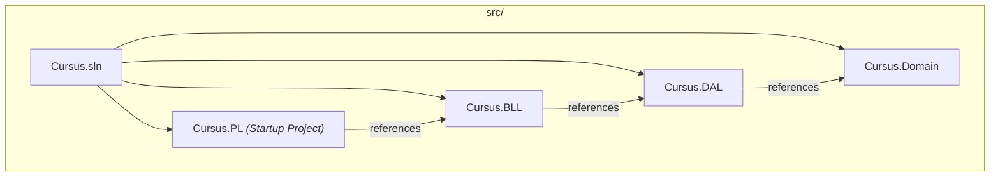

# Cursus Development Setup Guide

Welcome to the Cursus project! This guide provides the exact steps needed to get the Cursus application running locally on your specific machine.

---

## Architecture Overview

Before diving into setup, understand how the solution is structured:



- **`Cursus.PL`** is the startup project — this is what you `dotnet run`.
- **`Cursus.DAL`** holds the database context and migrations.
- EF Core commands always need both `--project Cursus.DAL` and `--startup-project Cursus.PL`.

---

## 1. Prerequisites

Before cloning the repository, ensure you have the following installed based on your OS:

### All Platforms
- **.NET SDK:** We are currently targeting **.NET 10**. (Ensure `dotnet --version` outputs a `10.x` version).
- **Git:** Version control.
- **EF Core CLI tool:**
  ```bash
  dotnet tool install --global dotnet-ef
  ```
- **IDE:** 
  - *Windows:* Visual Studio 2022 (Recommended) or VS Code.
  - *Linux:* JetBrains Rider or VS Code with the C# Dev Kit extension.

### Database Setup (Crucial OS Difference)

Since we are using **SQL Server** and Entity Framework Core, the setup differs heavily based on your operating system.

#### 🪟 Windows
Windows natively supports SQL Server.
1. Install **SQL Server Express** or ensure **LocalDB** is installed via the Visual Studio Installer (Data storage and processing workload).
2. LocalDB connection strings (default in ASP.NET generated templates) will work out of the box.

#### 🐧 Linux
SQL Server does not run natively on Linux, so you **must use Docker** to run the database.
1. Install **Docker** and **Docker Compose** on your distro.
2. Use the repository Docker Compose setup (recommended):
   ```bash
   cd Cursus
   cp .env.example .env
   # Edit .env and set SQL_SA_PASSWORD to a strong local password.
   docker compose up -d
   ```
3. **Important:** Override the connection string in the web project so EF Core points to your Docker SQL Server instead of Windows LocalDB.
   - Create a file named `appsettings.Development.json` in `src/Cursus.PL/` (if it doesn't exist).
   - Add the following connection string:
     ```json
     {
       "ConnectionStrings": {
         "DefaultConnection": "Server=localhost,1433;Database=CursusDb;User Id=sa;Password=<same SQL_SA_PASSWORD from .env>;TrustServerCertificate=True;"
       }
     }
     ```
   *(Note: Never commit your personal password/connection string to Git. `appsettings.Development.json` is usually ignored or safe for local overrides).*

4. Optional checks:
   ```bash
   docker compose ps
   docker compose logs -f sqlserver
   ```

---

## 2. Cloning the Repository & Initial Setup

Once your database engine is running, set up the project:

```bash
# 1. Clone the repository
git clone https://github.com/3bdo-Yahya/Cursus.git
cd Cursus

# 2. Restore all NuGet packages
cd src
dotnet restore
```

---

## 3. OpenAI AI Advisor Key

The AI Advisor uses OpenAI through the `OpenAi` configuration section in `src/Cursus.PL/appsettings.json`.

Never commit a real OpenAI API key to `appsettings.json`, `appsettings.Development.json`, or any other tracked file. For local development, store the key with .NET user secrets.

From the `src/` directory:

```bash
# Store your local OpenAI API key securely
dotnet user-secrets set "OpenAi:ApiKey" "YOUR_OPENAI_API_KEY" --project Cursus.PL
```

The web project already has a `UserSecretsId`, so `dotnet user-secrets init` should not be needed. If you ever create a new web project or remove the `UserSecretsId`, initialize secrets first:

```bash
dotnet user-secrets init --project Cursus.PL
```

Optional local overrides:

```bash
dotnet user-secrets set "OpenAi:Model" "gpt-4o-mini" --project Cursus.PL
dotnet user-secrets set "OpenAi:MaxOutputTokenCount" "500" --project Cursus.PL
dotnet user-secrets set "OpenAi:Temperature" "0.3" --project Cursus.PL
dotnet user-secrets set "OpenAi:TopP" "0.9" --project Cursus.PL
```

To confirm the key exists:

```bash
dotnet user-secrets list --project Cursus.PL
```

> **Security:** `dotnet user-secrets list` prints secret values. Do not share screenshots or logs that include the output.

For deployed environments, set the key as an environment variable instead of using user secrets:

```bash
OpenAi__ApiKey=YOUR_OPENAI_API_KEY
```

The AI Advisor will show the configured fallback message if the key is missing, invalid, or the OpenAI account has no available quota.

---

## 4. Database Migrations

You need to apply the database schema so your local SQL Server knows what tables to create.

```bash
# From the src/ directory:
dotnet ef database update --project Cursus.DAL --startup-project Cursus.PL
```

*If you get an error here, it means your connection string is wrong or your SQL Server/Docker container is not running.*

---

## 5. Running the Application

```bash
# From the src/ directory:

# Build the project to ensure there are no compilation errors
dotnet build

# Run the startup project
dotnet run --project Cursus.PL
```

The terminal will output the local URL (usually `https://localhost:5001` or `http://localhost:5000`). Open this in your browser.

### Verifying the Startup

On first run, the application will:
1. Apply any pending EF Core migrations.
2. Seed default roles (`Admin`, `Student`).
3. Seed a default admin account (configured via `appsettings.json` → `IdentitySeedOptions`).
4. Seed sample university catalog data (courses, departments, prerequisites) from JSON files in `Cursus.DAL/Database/SeedData/`.

---

## 6. Daily Git Workflow (Gitflow Lite)

As per our `CONTRIBUTING.md`, we use a structured tracking workflow. We track tasks in **ClickUp** and code in **GitHub**.

1. **Never work directly on `master` or `develop`.**
2. When starting a ClickUp task, pull the latest `develop` branch and create a new feature branch:
   ```bash
   git checkout develop
   git pull origin develop
   # Example naming: feature/S2-007-course-service
   git checkout -b feature/[clickup-task-id]-short-description
   ```
3. Commit your changes logically.
4. Push your branch to GitHub and **Open a Pull Request** against `develop`.
5. Request a peer review. (Your PR must pass the automated GitHub CI build before it can be squash-merged).

---

## 7. Common Commands Reference

```bash
# ── Build & Run ──────────────────────────────────────
dotnet build                                                    # Build entire solution
dotnet run --project Cursus.PL                                  # Run the web app

# ── Database ─────────────────────────────────────────
dotnet ef migrations add <Name> --project Cursus.DAL --startup-project Cursus.PL
dotnet ef database update --project Cursus.DAL --startup-project Cursus.PL
dotnet ef migrations list --project Cursus.DAL --startup-project Cursus.PL

# ── Code Quality ─────────────────────────────────────
dotnet format                                                   # Auto-format code
dotnet build --configuration Release                            # Stricter build check
```

> **Important:** All `dotnet ef` commands must be run from the `src/` directory with the `--project` and `--startup-project` flags pointing to the correct layer projects.

---

## 8. Troubleshooting Common OS Issues

- **Line Endings (CRLF vs LF):** Windows uses CRLF for line breaks, Linux uses LF. To prevent Git from showing every file as "modified" just because of line endings, ensure you have `.gitattributes` configured properly (it is already included in our repo). If you have issues, run:
  ```bash
  git config --global core.autocrlf input # On Linux
  git config --global core.autocrlf true  # On Windows
  ```
- **HTTPS Certificate Trust (Linux):** ASP.NET Core dev certificates often throw "Not Trusted" warnings on Linux browsers.
  - On Linux, run `dotnet dev-certs https --trust`.
  - If your browser still complains, you may need to manually import the cert to Chrome/Firefox, or temporarily bypass it by typing `thisisunsafe` on the error screen (Chrome only).

- **"Project Cursus.DAL not found" errors:** Make sure you are running EF commands from the `src/` directory, not from the repository root or from inside a project folder.

---

*For architectural guidelines, PR rules, and coding conventions, refer to [CONTRIBUTING.md](CONTRIBUTING.md).*
